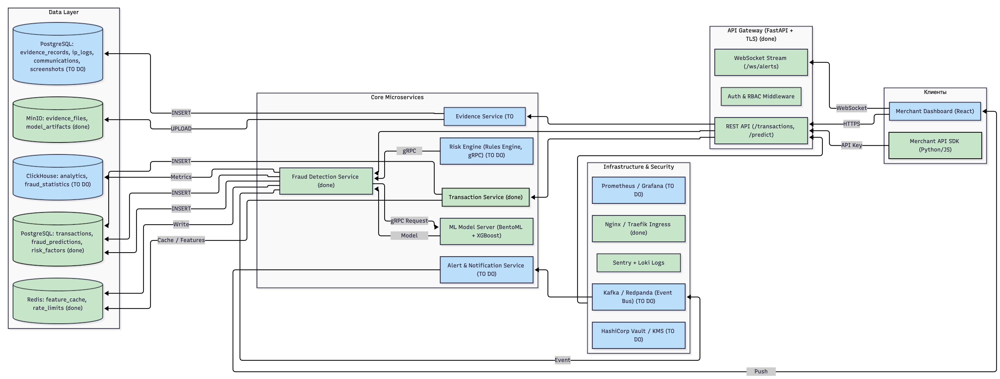
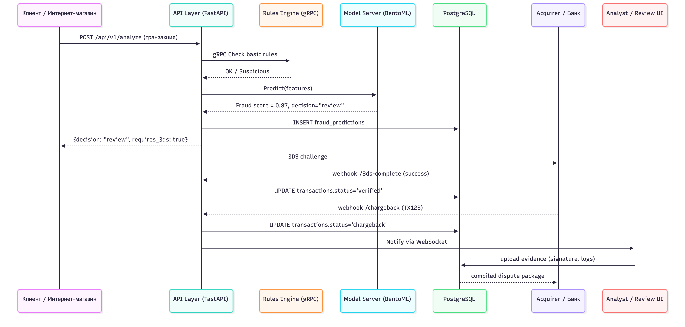

# FraudGuard AI

Облачный сервис на основе искусственного интеллекта для обнаружения мошенничества и предотвращения chargeback в реальном времени.

[Ссылка на доку API](https://antifraud-ml-production.up.railway.app/docs#/)

---

## Содержание

1. [Описание MVP](#1-описание-mvp)
2. [Техническая архитектура](#2-техническая-архитектура)
3. [Используемые технологии](#3-используемые-технологии)
4. [API и интеграции](#4-api-и-интеграции)
5. [База данных](#5-база-данных)
6. [Безопасность](#6-безопасность)
7. [Быстрый старт](#быстрый-старт)
8. [ML Модель](#ml-модель)
9. [Тестирование](#тестирование)

---

## 1. Описание MVP

### 1.1. Функциональность текущей версии продукта

**FraudGuard AI v1.0.0** представляет собой минимально жизнеспособный продукт (MVP) для обнаружения мошеннических финансовых транзакций в реальном времени. Система обеспечивает комплексную защиту на всех этапах жизненного цикла транзакции.

#### 1.1.1. Основные возможности

**Анализ транзакций в реальном времени:**
- Мгновенный анализ входящих транзакций с использованием ML-модели XGBoost
- Оценка вероятности мошенничества с точностью **Recall ~98.5%** и **Precision ~83.1%**
- Анализ более 9 ключевых признаков транзакции
- Время отклика менее 100ms для одиночных транзакций

**Многоуровневая система оценки рисков:**
- Автоматическое определение уровня риска: `LOW`, `MEDIUM`, `HIGH`, `CRITICAL`
- Расчет комплексного risk score (0-100 баллов)
- Оценка уверенности модели в предсказании (confidence score)
- Генерация персонализированных рекомендаций для каждой транзакции

**Поддержка различных типов транзакций:**
- `PAYMENT` - платежи
- `TRANSFER` - переводы между счетами
- `CASH_OUT` - снятие наличных
- `CASH_IN` - пополнение счета
- `DEBIT` - дебетовые операции

**Пакетная обработка:**
- Возможность анализа нескольких транзакций одновременно
- Оптимизированная обработка для batch-запросов
- Сохранение производительности при высокой нагрузке

**Сбор доказательств для chargeback:**
- Автоматическое логирование всех транзакций
- Сохранение IP-адресов, device fingerprints, user agents
- Поддержка добавления трек-номеров доставки
- Хранение переписки с клиентами
- Экспорт доказательств в формате для банков

**Мониторинг и статистика:**
- Отслеживание общего количества проанализированных транзакций
- Подсчет обнаруженных случаев мошенничества
- Расчет процента мошенничества (fraud rate)
- Время последнего предсказания
- Статус загрузки ML-модели

#### 1.1.2. Бизнес-логика

**Этап ДО совершения платежа (профилактика):**
- AI-система анализирует все параметры транзакции до её завершения
- Автоматическая блокировка транзакций с уровнем риска `CRITICAL` (risk_score ≥ 80)
- Рекомендации по требованию дополнительной верификации для транзакций с `HIGH` риском

**Этап совершения платежа (верификация):**
- Интеграция с протоколом 3D-Secure (рекомендации)
- Автоматические рекомендации по требованию подтверждения через 3D-Secure для транзакций с risk_score ≥ 50
- Анализ рисков для определения необходимости дополнительной верификации

**Этап ПОСЛЕ совершения платежа (документирование):**
- Автоматический сбор всех доказательств проведения транзакции
- Сохранение технических данных (IP, device fingerprint, user agent)
- Поддержка добавления информации о доставке (трек-номера, подписи)
- Хранение переписки с клиентами
- Подготовка пакета документов для оспаривания chargeback

#### 1.1.3. Ограничения MVP

- Базовая реализация без полной интеграции с платежными системами
- Хранение доказательств в памяти (in-memory storage)
- Отсутствие полноценной базы данных для истории транзакций
- Базовая система логирования без централизованного сбора логов
- Отсутствие системы аутентификации и авторизации пользователей
- Нет интеграции с внешними сервисами геолокации и device fingerprinting

---

## 2. Техническая архитектура

### 2.1. Общая архитектура системы

Система построена по принципу **микросервисной архитектуры** с четким разделением ответственности между компонентами. Архитектура следует принципам **SOLID** и использует **асинхронную обработку** для обеспечения высокой производительности.

Архитектура представлена ниже



Sequence диаграмма сервиса



### 2.2. Компоненты системы

#### 2.2.1. Application Layer (`app/main.py`)

**FastAPI Application:**
- Основное приложение на базе FastAPI framework
- Управление жизненным циклом через `lifespan` context manager
- Асинхронная обработка запросов
- Middleware для CORS
- Background tasks для асинхронного логирования

**Эндпоинты:**
- `GET /` - корневой эндпоинт с информацией о сервисе
- `GET /health` - health check с проверкой состояния ML-модели
- `POST /api/v1/analyze` - анализ одиночной транзакции
- `POST /api/v1/batch-analyze` - пакетный анализ транзакций
- `GET /api/v1/stats` - получение статистики работы системы

#### 2.2.2. ML Layer (`app/ml/`)

**FraudDetector (`fraud_detector.py`):**
- Загрузка и управление XGBoost моделью
- Предсказание вероятности мошенничества
- Fallback на эвристический анализ при отсутствии модели
- Сбор статистики предсказаний
- Методы для сохранения и загрузки модели

**TransactionPreprocessor (`preprocessor.py`):**
- Feature engineering для подготовки данных
- One-hot encoding типов транзакций
- Логарифмическое биннирование сумм
- Расчет признака `fraud_share` по бакетам
- Создание признака `balanceChange_Dest`

**ModelTrainer (`model_trainer.py`):**
- Обучение XGBoost модели на исторических данных
- 5-fold cross-validation
- Random oversampling для балансировки классов
- Удаление выбросов методом IQR
- Сохранение обученной модели

#### 2.2.3. Services Layer (`services/`)

**RiskAnalyzer (`risk_analyzer.py`):**
- Комплексная оценка рисков транзакции
- Анализ типа транзакции с применением множителей риска
- Анализ суммы транзакции (большие/малые/круглые суммы)
- Анализ паттернов изменения балансов
- Анализ дополнительных факторов (IP, device_id)
- Определение уровня риска и необходимости блокировки
- Расчет confidence score

**EvidenceCollector (`evidence_collector.py`):**
- Сбор и хранение доказательств транзакций
- Логирование IP-адресов и device fingerprints
- Управление информацией о доставке
- Хранение переписки с клиентами
- Сохранение скриншотов
- Экспорт доказательств для chargeback

#### 2.2.4. Data Models (`app/models.py`)

**Pydantic модели для валидации:**
- `TransactionRequest` - входные данные транзакции
- `TransactionResponse` - результат анализа
- `RiskAssessment` - оценка рисков
- `EvidenceRecord` - запись доказательств
- `HealthCheck` - статус здоровья сервиса
- Enums: `TransactionType`, `RiskLevel`

### 2.3. Поток обработки транзакции

```
1. Получение запроса
   │
   ▼
2. Валидация данных (Pydantic)
   │
   ▼
3. Предобработка (TransactionPreprocessor)
   │
   ▼
4. ML Предсказание (FraudDetector)
   │
   ▼
5. Анализ рисков (RiskAnalyzer)
   │
   ▼
6. Генерация рекомендаций
   │
   ▼
7. Логирование в фоне (EvidenceCollector)
   │
   ▼
8. Возврат результата клиенту
```

### 2.4. Управление жизненным циклом

Система использует FastAPI `lifespan` для управления инициализацией и очисткой:

**При запуске:**
1. Загрузка ML-модели из файла
2. Инициализация RiskAnalyzer
3. Инициализация EvidenceCollector
4. Проверка готовности всех компонентов

**При завершении:**
1. Очистка ресурсов
2. Сохранение статистики (если необходимо)
3. Graceful shutdown

### 2.5. Масштабируемость

**Горизонтальное масштабирование:**
- Stateless архитектура позволяет запускать несколько инстансов
- Можно использовать load balancer (nginx, HAProxy)
- Поддержка Docker и Docker Compose для оркестрации

**Вертикальное масштабирование:**
- Асинхронная обработка запросов
- Background tasks для тяжелых операций
- Оптимизированная загрузка ML-модели в память

---

## 3. Используемые технологии

### 3.1. Backend Framework

**FastAPI 0.104.1:**
- Современный веб-фреймворк на Python
- Автоматическая генерация OpenAPI/Swagger документации
- Встроенная валидация данных через Pydantic
- Асинхронная обработка запросов (async/await)
- Высокая производительность (сопоставима с Node.js и Go)

**Uvicorn 0.24.0:**
- ASGI сервер для запуска FastAPI приложения
- Поддержка HTTP/1.1 и WebSockets
- Автоматический reload в режиме разработки
- Оптимизированная обработка асинхронных запросов

### 3.2. Machine Learning

**XGBoost 2.0.3:**
- Градиентный бустинг для задач классификации
- Высокая точность на структурированных данных
- Быстрое предсказание (< 10ms на транзакцию)
- Поддержка сохранения/загрузки моделей в JSON формате

**scikit-learn 1.3.2:**
- Инструменты для предобработки данных
- Метрики для оценки модели (precision, recall, F1-score)
- StratifiedKFold для кросс-валидации
- Интеграция с другими ML библиотеками

**pandas 2.1.3:**
- Обработка и манипуляция данными
- DataFrame для feature engineering
- Интеграция с NumPy и scikit-learn

**numpy 1.26.2:**
- Математические операции
- Логарифмическое биннирование
- Оптимизированные вычисления

**imbalanced-learn 0.11.0:**
- Методы для работы с несбалансированными данными
- Random oversampling для балансировки классов

**joblib 1.3.2:**
- Сериализация и десериализация Python объектов
- Потенциальное использование для кэширования

### 3.3. Data Validation

**Pydantic 2.5.0:**
- Валидация данных на основе типов Python
- Автоматическая генерация JSON схем
- Поддержка field validators
- ConfigDict для конфигурации моделей

**pydantic-settings 2.1.0:**
- Управление настройками приложения
- Загрузка переменных окружения из `.env` файла
- Валидация конфигурации

### 3.4. Database (опционально)

**SQLAlchemy 2.0.23:**
- ORM для работы с базами данных
- Поддержка PostgreSQL, MySQL, SQLite
- Асинхронные запросы (через asyncpg/aiomysql)

**psycopg2-binary 2.9.9:**
- PostgreSQL адаптер для Python
- Используется для подключения к PostgreSQL

### 3.5. Caching

**Redis 5.0.1:**
- In-memory хранилище данных
- Кэширование результатов предсказаний
- Хранение сессий (потенциально)

**aioredis 2.0.1:**
- Асинхронный клиент Redis для Python
- Интеграция с asyncio

### 3.6. Security

**python-jose[cryptography] 3.3.0:**
- JWT токены для аутентификации
- Криптографические операции
- Поддержка различных алгоритмов подписи

**passlib[bcrypt] 1.7.4:**
- Хеширование паролей
- Bcrypt для безопасного хранения паролей

### 3.7. Monitoring & Logging

**prometheus-client 0.19.0:**
- Экспорт метрик в формате Prometheus
- Мониторинг производительности
- Интеграция с системами мониторинга

**python-json-logger 2.0.7:**
- Структурированное логирование в JSON формате
- Интеграция с системами сбора логов (ELK, Loki)

### 3.8. Testing

**pytest 7.4.3:**
- Фреймворк для тестирования
- Поддержка фикстур и параметризации
- Покрытие кода тестами

**pytest-asyncio 0.21.1:**
- Поддержка асинхронных тестов
- Тестирование async функций

**httpx 0.25.2:**
- HTTP клиент для тестирования API
- Поддержка async запросов

### 3.9. Deployment

**Docker:**
- Контейнеризация приложения
- Изоляция зависимостей
- Упрощение развертывания

**Docker Compose:**
- Оркестрация нескольких контейнеров
- Управление сетями и volumes
- Интеграция с Redis и PostgreSQL

### 3.10. Python Version

**Python 3.11+**
- Современные возможности языка
- Улучшенная производительность
- Поддержка type hints и async/await

---

## 4. API и интеграции

### 4.1. REST API Endpoints

#### 4.1.1. Корневой эндпоинт

**GET** `/`

Возвращает базовую информацию о сервисе.

**Response:**
```json
{
  "service": "FraudGuard AI",
  "version": "1.0.0",
  "status": "operational",
  "description": "Система обнаружения мошенничества в реальном времени"
}
```

#### 4.1.2. Health Check

**GET** `/health`

Проверка состояния сервиса и загрузки ML-модели.

**Response:**
```json
{
  "status": "healthy",
  "timestamp": "2025-01-15T10:30:00Z",
  "is_model_loaded": true,
  "version": "1.0.0"
}
```

**Status codes:**
- `200 OK` - сервис работает
- `503 Service Unavailable` - модель не загружена (status: "degraded")

#### 4.1.3. Анализ транзакции

**POST** `/api/v1/analyze`

Анализирует одну транзакцию и возвращает оценку риска мошенничества.

**Request Body:**
```json
{
  "transaction_id": "TXN_1234567890",
  "type": "TRANSFER",
  "amount": 150000.0,
  "nameOrig": "C123456789",
  "oldbalanceOrg": 200000.0,
  "newbalanceOrig": 50000.0,
  "nameDest": "C987654321",
  "oldbalanceDest": 100000.0,
  "newbalanceDest": 250000.0,
  "ip_address": "192.168.1.1",
  "device_id": "device_12345",
  "user_agent": "Mozilla/5.0...",
  "location": "Moscow, Russia",
  "timestamp": "2025-01-15T10:30:00Z"
}
```

**Response:**
```json
{
  "transaction_id": "TXN_1234567890",
  "is_fraud": true,
  "fraud_probability": 0.8523,
  "risk_level": "HIGH",
  "risk_score": 85.23,
  "confidence": 0.92,
  "recommendations": [
    "БЛОКИРОВАТЬ ТРАНЗАКЦИЮ - высокий риск мошенничества",
    "Требуется подтверждение через 3D-Secure",
    "Запросить дополнительную верификацию пользователя"
  ],
  "requires_3d_secure": true,
  "should_block": true,
  "timestamp": "2025-01-15T10:30:00Z"
}
```

**Status codes:**
- `200 OK` - успешный анализ
- `422 Unprocessable Entity` - ошибка валидации данных
- `500 Internal Server Error` - внутренняя ошибка сервера
- `503 Service Unavailable` - модель не загружена

#### 4.1.4. Пакетный анализ

**POST** `/api/v1/batch-analyze`

Анализирует несколько транзакций одновременно.

**Request Body:**
```json
[
  {
    "type": "TRANSFER",
    "amount": 10000.0,
    ...
  },
  {
    "type": "PAYMENT",
    "amount": 5000.0,
    ...
  }
]
```

**Response:**
```json
[
  {
    "transaction_id": "TXN_...",
    "is_fraud": false,
    "fraud_probability": 0.15,
    ...
  },
  {
    "transaction_id": "TXN_...",
    "is_fraud": false,
    "fraud_probability": 0.08,
    ...
  }
]
```

#### 4.1.5. Статистика

**GET** `/api/v1/stats`

Возвращает статистику работы системы.

**Response:**
```json
{
  "total_predictions": 15234,
  "fraud_detected": 234,
  "fraud_rate": 0.0154,
  "last_prediction_time": "2025-01-15T10:30:00Z",
  "is_model_loaded": true
}
```

### 4.2. Внешние интеграции (планируемые)

#### 4.2.1. Платежные системы

**3D-Secure протокол:**
- Verified by VISA
- Mastercard SecureCode
- Интеграция через платежные шлюзы

**Статус:** Рекомендации по использованию 3D-Secure генерируются автоматически, полная интеграция в разработке.

#### 4.2.2. Геолокационные сервисы

**Планируемые интеграции:**
- MaxMind GeoIP2 для определения местоположения по IP
- Проверка на VPN/Proxy
- Анализ несоответствий геолокации

#### 4.2.3. Device Fingerprinting

**Планируемые сервисы:**
- FingerprintJS для уникальной идентификации устройств
- Анализ браузерных отпечатков
- Обнаружение эмуляторов и виртуальных машин

#### 4.2.4. Базы данных мошенничества

**Потенциальные интеграции:**
- Сверка с черными списками IP-адресов
- Проверка по базам известных мошенников
- Анализ паттернов из исторических данных

### 4.3. Webhooks (планируемые)

**События для отправки:**
- `transaction.analyzed` - транзакция проанализирована
- `fraud.detected` - обнаружено мошенничество
- `risk.high` - высокий уровень риска
- `chargeback.initiated` - инициирован chargeback

### 4.4. API Rate Limiting

**Текущая реализация:**
- Базовая защита через FastAPI middleware
- Рекомендуется использовать nginx или специализированные решения

**Планируемые улучшения:**
- Интеграция с Redis для распределенного rate limiting
- Настраиваемые лимиты для разных клиентов
- Приоритизация запросов

### 4.5. API Authentication (планируемое)

**Методы аутентификации:**
- API Key authentication
- JWT токены
- OAuth 2.0 для корпоративных клиентов

---

## 5. База данных

### 5.1. Текущая реализация

**In-Memory Storage:**
- Доказательства хранятся в памяти (`EvidenceCollector.evidence_storage`)
- Статистика хранится в памяти (`FraudDetector.stats`)
- Данные теряются при перезапуске сервиса

**Преимущества:**
- Быстрый доступ к данным
- Нет необходимости в настройке БД для MVP
- Простота развертывания

**Недостатки:**
- Потеря данных при перезапуске
- Ограниченный объем хранимых данных
- Невозможность масштабирования

### 5.2. Планируемая структура базы данных

#### 5.2.1. PostgreSQL Schema

**Таблица `transactions`:**
```sql
CREATE TABLE transactions (
    id SERIAL PRIMARY KEY,
    transaction_id VARCHAR(255) UNIQUE NOT NULL,
    type VARCHAR(50) NOT NULL,
    amount DECIMAL(15, 2) NOT NULL,
    name_orig VARCHAR(255),
    old_balance_org DECIMAL(15, 2),
    new_balance_orig DECIMAL(15, 2),
    name_dest VARCHAR(255),
    old_balance_dest DECIMAL(15, 2),
    new_balance_dest DECIMAL(15, 2),
    ip_address INET,
    device_id VARCHAR(255),
    user_agent TEXT,
    location VARCHAR(255),
    created_at TIMESTAMP WITH TIME ZONE DEFAULT NOW(),
    INDEX idx_transaction_id (transaction_id),
    INDEX idx_created_at (created_at),
    INDEX idx_type (type)
);
```

**Таблица `fraud_predictions`:**
```sql
CREATE TABLE fraud_predictions (
    id SERIAL PRIMARY KEY,
    transaction_id VARCHAR(255) NOT NULL,
    fraud_probability DECIMAL(5, 4) NOT NULL,
    is_fraud BOOLEAN NOT NULL,
    risk_level VARCHAR(20) NOT NULL,
    risk_score DECIMAL(5, 2) NOT NULL,
    confidence DECIMAL(5, 4) NOT NULL,
    requires_3d_secure BOOLEAN DEFAULT FALSE,
    should_block BOOLEAN DEFAULT FALSE,
    created_at TIMESTAMP WITH TIME ZONE DEFAULT NOW(),
    FOREIGN KEY (transaction_id) REFERENCES transactions(transaction_id),
    INDEX idx_transaction_id (transaction_id),
    INDEX idx_is_fraud (is_fraud),
    INDEX idx_risk_level (risk_level),
    INDEX idx_created_at (created_at)
);
```

**Таблица `risk_factors`:**
```sql
CREATE TABLE risk_factors (
    id SERIAL PRIMARY KEY,
    prediction_id INTEGER NOT NULL,
    factor TEXT NOT NULL,
    created_at TIMESTAMP WITH TIME ZONE DEFAULT NOW(),
    FOREIGN KEY (prediction_id) REFERENCES fraud_predictions(id),
    INDEX idx_prediction_id (prediction_id)
);
```

**Таблица `recommendations`:**
```sql
CREATE TABLE recommendations (
    id SERIAL PRIMARY KEY,
    prediction_id INTEGER NOT NULL,
    recommendation TEXT NOT NULL,
    created_at TIMESTAMP WITH TIME ZONE DEFAULT NOW(),
    FOREIGN KEY (prediction_id) REFERENCES fraud_predictions(id),
    INDEX idx_prediction_id (prediction_id)
);
```

**Таблица `evidence_records`:**
```sql
CREATE TABLE evidence_records (
    id SERIAL PRIMARY KEY,
    transaction_id VARCHAR(255) NOT NULL,
    tracking_number VARCHAR(255),
    delivery_signature TEXT,
    device_fingerprint VARCHAR(255),
    created_at TIMESTAMP WITH TIME ZONE DEFAULT NOW(),
    updated_at TIMESTAMP WITH TIME ZONE DEFAULT NOW(),
    FOREIGN KEY (transaction_id) REFERENCES transactions(transaction_id),
    INDEX idx_transaction_id (transaction_id)
);
```

**Таблица `ip_logs`:**
```sql
CREATE TABLE ip_logs (
    id SERIAL PRIMARY KEY,
    evidence_id INTEGER NOT NULL,
    log_entry TEXT NOT NULL,
    created_at TIMESTAMP WITH TIME ZONE DEFAULT NOW(),
    FOREIGN KEY (evidence_id) REFERENCES evidence_records(id),
    INDEX idx_evidence_id (evidence_id)
);
```

**Таблица `customer_communications`:**
```sql
CREATE TABLE customer_communications (
    id SERIAL PRIMARY KEY,
    evidence_id INTEGER NOT NULL,
    message_type VARCHAR(50) NOT NULL,
    content TEXT NOT NULL,
    created_at TIMESTAMP WITH TIME ZONE DEFAULT NOW(),
    FOREIGN KEY (evidence_id) REFERENCES evidence_records(id),
    INDEX idx_evidence_id (evidence_id),
    INDEX idx_message_type (message_type)
);
```

**Таблица `screenshots`:**
```sql
CREATE TABLE screenshots (
    id SERIAL PRIMARY KEY,
    evidence_id INTEGER NOT NULL,
    screenshot_url TEXT NOT NULL,
    created_at TIMESTAMP WITH TIME ZONE DEFAULT NOW(),
    FOREIGN KEY (evidence_id) REFERENCES evidence_records(id),
    INDEX idx_evidence_id (evidence_id)
);
```

### 5.3. Основные сущности

#### 5.3.1. Transaction (Транзакция)

Основная сущность, представляющая финансовую транзакцию.

**Атрибуты:**
- `transaction_id` - уникальный идентификатор
- `type` - тип транзакции (PAYMENT, TRANSFER, etc.)
- `amount` - сумма транзакции
- `nameOrig/nameDest` - идентификаторы отправителя/получателя
- `oldbalanceOrg/newbalanceOrig` - балансы отправителя
- `oldbalanceDest/newbalanceDest` - балансы получателя
- `ip_address` - IP-адрес клиента
- `device_id` - идентификатор устройства
- `user_agent` - User Agent браузера
- `location` - геолокация
- `timestamp` - время транзакции

#### 5.3.2. Fraud Prediction (Предсказание мошенничества)

Результат анализа транзакции ML-моделью.

**Атрибуты:**
- `transaction_id` - связь с транзакцией
- `fraud_probability` - вероятность мошенничества (0-1)
- `is_fraud` - бинарная классификация
- `risk_level` - уровень риска (LOW, MEDIUM, HIGH, CRITICAL)
- `risk_score` - числовая оценка риска (0-100)
- `confidence` - уверенность модели (0-1)
- `requires_3d_secure` - требуется ли 3D-Secure
- `should_block` - следует ли блокировать

#### 5.3.3. Evidence Record (Запись доказательств)

Собранные доказательства для защиты от chargeback.

**Атрибуты:**
- `transaction_id` - связь с транзакцией
- `tracking_number` - трек-номер доставки
- `delivery_signature` - подпись получателя
- `device_fingerprint` - отпечаток устройства
- `ip_logs` - логи IP-адресов
- `customer_communications` - переписка с клиентом
- `screenshots` - скриншоты

### 5.4. Миграции базы данных

**Инструменты:**
- Alembic для управления миграциями
- SQLAlchemy для определения моделей

**Пример миграции:**
```python
# migrations/versions/001_initial_schema.py
from alembic import op
import sqlalchemy as sa

def upgrade():
    op.create_table(
        'transactions',
        sa.Column('id', sa.Integer(), nullable=False),
        sa.Column('transaction_id', sa.String(255), nullable=False),
        ...
    )

def downgrade():
    op.drop_table('transactions')
```

### 5.5. Индексы и оптимизация

**Критические индексы:**
- `transaction_id` - для быстрого поиска транзакций
- `created_at` - для временных запросов
- `is_fraud` - для фильтрации мошеннических транзакций
- `risk_level` - для группировки по уровням риска

**Партиционирование (для больших объемов):**
- По дате создания (`created_at`)
- По типу транзакции (`type`)

### 5.6. Резервное копирование

**Стратегия:**
- Ежедневные полные бэкапы
- Инкрементальные бэкапы каждый час
- Хранение бэкапов в отдельном хранилище
- Тестирование восстановления

---

## 6. Безопасность

### 6.1. Защита данных

#### 6.1.1. Шифрование данных в покое

**Текущая реализация:**
- Данные хранятся в памяти (для MVP)
- Файлы моделей хранятся в незашифрованном виде

**Планируемые меры:**
- Шифрование базы данных на уровне диска
- Использование TDE (Transparent Data Encryption) для PostgreSQL
- Шифрование файлов моделей с использованием AES-256
- Управление ключами через KMS (Key Management Service)

#### 6.1.2. Шифрование данных в передаче

**HTTPS/TLS:**
- Обязательное использование TLS 1.2+ для всех API запросов
- Сертификаты от доверенных CA
- HSTS (HTTP Strict Transport Security) заголовки
- Регулярное обновление сертификатов

**Внутренняя коммуникация:**
- TLS для связи между сервисами
- mTLS (mutual TLS) для сервис-к-сервис аутентификации

### 6.2. Аутентификация и авторизация

#### 6.2.1. API Key Authentication (планируемое)

**Реализация:**
- Хранение API ключей в базе данных (хешированные)
- Проверка ключей через middleware
- Ротация ключей каждые 90 дней
- Отзыв скомпрометированных ключей

**Пример:**
```python
@app.middleware("http")
async def api_key_middleware(request: Request, call_next):
    api_key = request.headers.get("X-API-Key")
    if not validate_api_key(api_key):
        return JSONResponse(
            status_code=401,
            content={"detail": "Invalid API key"}
        )
    return await call_next(request)
```

#### 6.2.2. JWT Tokens (планируемое)

**Использование:**
- Аутентификация пользователей через JWT
- Короткое время жизни токенов (15 минут)
- Refresh tokens для продления сессии
- Blacklist для отозванных токенов

#### 6.2.3. Role-Based Access Control (RBAC) (планируемое)

**Роли:**
- `admin` - полный доступ
- `analyst` - просмотр статистики и транзакций
- `api_user` - только API доступ
- `readonly` - только чтение

### 6.3. Валидация входных данных

#### 6.3.1. Pydantic валидация

**Реализовано:**
- Автоматическая валидация типов данных
- Проверка диапазонов значений (amount > 0, amount < 10_000_000)
- Валидация форматов (IP-адреса, email, etc.)
- Защита от injection атак через типизацию

**Пример:**
```python
@field_validator('amount')
@classmethod
def validate_amount(cls, v):
    if v <= 0:
        raise ValueError('Сумма должна быть положительной')
    if v > 10_000_000:
        raise ValueError('Сумма превышает максимально допустимую')
    return v
```

#### 6.3.2. Rate Limiting

**Защита от DDoS:**
- Ограничение количества запросов с одного IP
- Ограничение по API ключу
- Использование Redis для распределенного rate limiting

**Пример конфигурации:**
```python
# 100 запросов в минуту на IP
# 1000 запросов в минуту на API ключ
```

### 6.4. Логирование и мониторинг безопасности

#### 6.4.1. Аудит логов

**Логируемые события:**
- Все API запросы с метаданными
- Попытки аутентификации (успешные и неуспешные)
- Обнаруженные случаи мошенничества
- Изменения конфигурации
- Доступ к чувствительным данным

**Формат логов:**
```json
{
  "timestamp": "2025-01-15T10:30:00Z",
  "level": "INFO",
  "event": "fraud_detected",
  "transaction_id": "TXN_123",
  "ip_address": "192.168.1.1",
  "user_id": "user_123",
  "risk_score": 85.23
}
```

#### 6.4.2. Обнаружение аномалий

**Мониторинг:**
- Необычные паттерны запросов
- Резкие изменения в fraud rate
- Множественные запросы с одного IP
- Попытки обхода rate limiting

### 6.5. Защита ML-модели

#### 6.5.1. Защита от adversarial attacks

**Меры:**
- Валидация входных данных на аномалии
- Ограничение диапазонов признаков
- Мониторинг распределения входных данных
- Обнаружение попыток манипуляции данными

#### 6.5.2. Версионирование моделей

**Стратегия:**
- Хранение всех версий моделей
- A/B тестирование новых моделей
- Откат к предыдущей версии при проблемах
- Подпись моделей для проверки целостности

### 6.6. Соответствие стандартам

#### 6.6.1. PCI DSS (планируемое)

**Требования:**
- Не хранить полные номера карт
- Шифрование всех данных карт
- Регулярные аудиты безопасности
- Разделение сетей

#### 6.6.2. GDPR (планируемое)

**Требования:**
- Право на удаление данных
- Право на доступ к данным
- Минимизация собираемых данных
- Явное согласие на обработку

### 6.7. Инфраструктурная безопасность

#### 6.7.1. Сетевая безопасность

**Меры:**
- Firewall правила
- Изоляция сервисов в отдельных сетях
- VPN для доступа администраторов
- DDoS защита на уровне инфраструктуры

#### 6.7.2. Контейнеризация

**Безопасность Docker:**
- Использование non-root пользователей в контейнерах
- Минимальные базовые образы
- Регулярное обновление образов
- Сканирование образов на уязвимости

#### 6.7.3. Secrets Management

**Управление секретами:**
- Хранение секретов в переменных окружения
- Использование секретных менеджеров (HashiCorp Vault, AWS Secrets Manager)
- Ротация секретов
- Отдельные секреты для разных окружений

### 6.8. Инцидент-менеджмент

#### 6.8.1. План реагирования на инциденты

**Процедуры:**
1. Обнаружение инцидента
2. Изоляция затронутых систем
3. Анализ и оценка ущерба
4. Устранение уязвимости
5. Восстановление сервисов
6. Пост-мортем анализ

#### 6.8.2. Уведомления

**Каналы:**
- Email уведомления для критических инцидентов
- Slack/Telegram для команды
- SMS для экстренных ситуаций

---

## Быстрый старт

### Установка зависимостей

```bash
pip install -r requirements.txt
```

### Обучение модели

Если у вас есть датасет с транзакциями (загружен в `./data/raw/`):

```bash
python -m app.ml.model_trainer
```

### Запуск приложения

```bash
# Вариант 1: Через run.py
python run.py

# Вариант 2: Через uvicorn напрямую
uvicorn app.main:app --reload --host 0.0.0.0 --port 8000
```

API будет доступен по адресу: `http://localhost:8000`

Документация API: `http://localhost:8000/docs`

### Запуск через Docker

```bash
# Сборка и запуск
docker-compose up -d

# Просмотр логов
docker-compose logs -f fraudguard

# Остановка
docker-compose down
```

---

## ML Модель

### Характеристики модели

- **Алгоритм**: XGBoost (Gradient Boosting)
- **Recall**: ~98.5% (обнаружение мошеннических транзакций)
- **Precision**: ~83.1%
- **F1-Score**: ~90.2%
- **Подход**: Фокус на максимизации recall для минимизации пропущенных случаев мошенничества

### Признаки (Features)

Модель использует 9 признаков:

1. `amount` - сумма транзакции
2. `oldbalanceOrg` - баланс отправителя до транзакции
3. `newbalanceOrig` - баланс отправителя после транзакции
4. `oldbalanceDest` - баланс получателя до транзакции
5. `newbalanceDest` - баланс получателя после транзакции
6. `type_CASH_OUT` - флаг типа транзакции CASH_OUT
7. `type_TRANSFER` - флаг типа транзакции TRANSFER
8. `balanceChange_Dest` - изменение баланса получателя
9. `fraud_share` - доля мошенничества в данном ценовом диапазоне

### Feature Engineering

- **One-hot encoding** для типов транзакций
- **Логарифмическое биннирование** сумм транзакций (25 бакетов)
- **Расчет изменения балансов** получателя
- **Random oversampling** для балансировки классов (соотношение 0.5)
- **Удаление выбросов** методом IQR (Interquartile Range)

### Обучение модели

**Процесс обучения:**
1. Загрузка и предобработка данных
2. Фильтрация по типам транзакций (только CASH_OUT и TRANSFER)
3. Создание признаков (feature engineering)
4. Удаление выбросов методом IQR
5. Random oversampling для балансировки классов
6. 5-fold cross-validation
7. Выбор лучшей модели по recall
8. Сохранение модели в JSON формате

**Параметры XGBoost:**
```python
{
    'objective': 'binary:logistic',
    'eval_metric': 'aucpr',
    'learning_rate': 0.05,
    'max_depth': 6,
    'min_child_weight': 1,
    'subsample': 0.8,
    'colsample_bytree': 0.8,
    'num_boost_round': 100
}
```

---

## Тестирование

```bash
# Запуск тестов
pytest tests/

# С покрытием
pytest --cov=app tests/

# С подробным выводом
pytest -v tests/
```

---

## Лицензия

MIT License

---

## Контакты

Для вопросов и предложений: создайте issue в репозитории.

---

**FraudGuard AI** - Защита вашего бизнеса от мошенничества 🛡️
